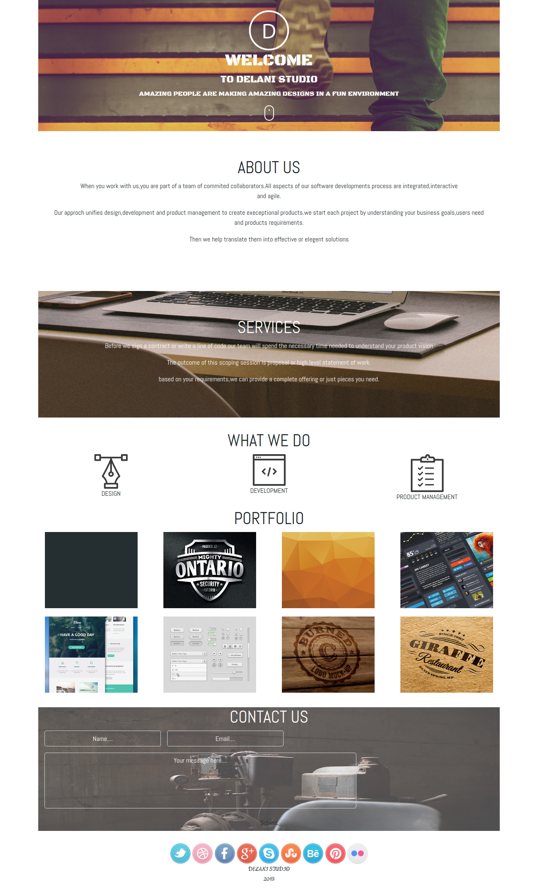

# {Akan Name}
#### {Delani Studio Project}, {4 October 2020}
#### By **{UMUTONI Marie Ritha}**
## Description
{Delani Studio Project contains welcom page,about us ,services studio can offer,what we do,portfolio and contacts where you can found adelani studio . }
## Setup/Installation Requirements
* UBUNTU
* Open Terminal
* Google Chrome
* internet
* [git clone] (https://github.com/UMUTONIRitha/Delani-std-project.git)
## Technologies Used
* HTML
* CSS
* JavaScript
* Bootstrap
* Jquery
## How Akan Project look

## Contact Information
{feel free to contact me via E-mail: rithamarie9@gmail.com in case you need any support or contribution.}
### License
* MIT license,Copyright (c) {2020} **{UMUTONI Marie Ritha}**
